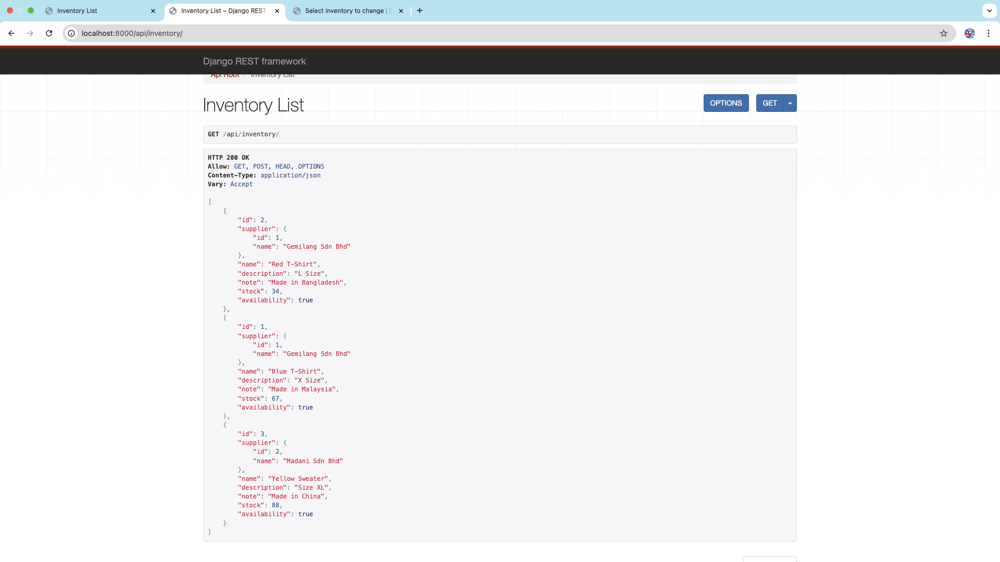

# KiraIMS
A simple inventory management system built with Django and Django Rest Framework (DRF).

📌 Features
✅ View a list of all inventory items along with supplier details.
✅ Search inventory items by name using API query parameters.
✅ View detailed information about each inventory item.
✅ Django Admin integration for managing inventory and suppliers.
✅ Simple unit tests for key views and API endpoints.

Prerequisites:
- Docker
- Visual Studio Code (VSC)
- pgAdmin (optional)

To Run:
1. Clone project from git
2. Open project in VSC, direct to root (KiraIMS)
3. Run command 'docker compose -f local.yml up --build -d'
4. Go to 'http://localhost:8000/inventory/' in browser.

Answer to requirements:
a. to view model, simply access database in pgAdmin with details as:
    DATABASE=postgres
    DB_PASSWORD=123456
    DB_USER=postgres
    DB_NAME=ims-local-postgres
    DB_HOST=postgres
    DB_PORT=5432

b. rendered inventory view can be access at 'http://localhost:8000/inventory/'
    RESTful api can be access at 'http://localhost:8000/api/inventory/'
    query parameters can be added to both view and api endpoint, as field lookups in django query, e.g. name__contains, name__startswith

c. selected inventory can be view in 'http://localhost:8000/inventory/<id>', or by pressing on view button in list UI. All inventory details are shown

d. Admin panel is allowed for CRUD operation. Superuser is dynamically created upon docker run.
    username: admin
    password: admin123

e. Test case can be run while running docker. 
    run command 'docker exec -it ims-django python manage.py test backendapp.apps.inventory'